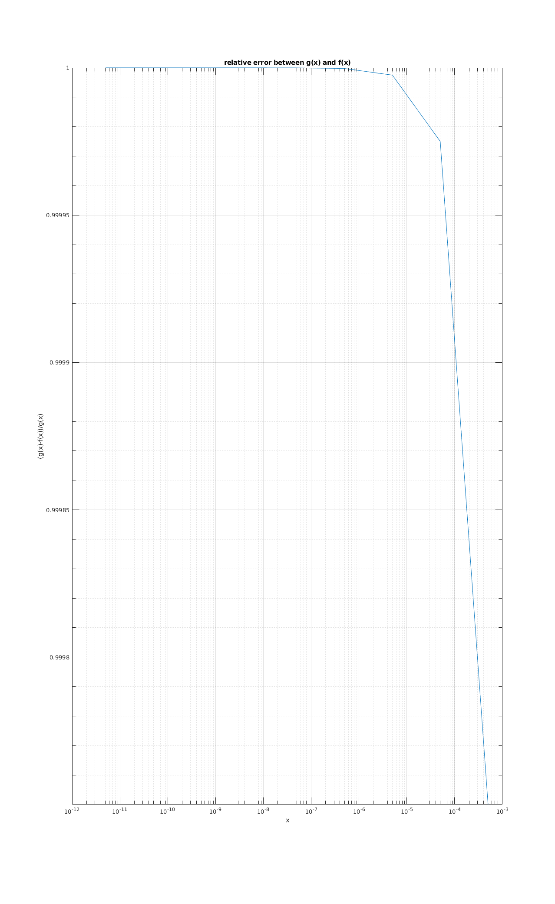
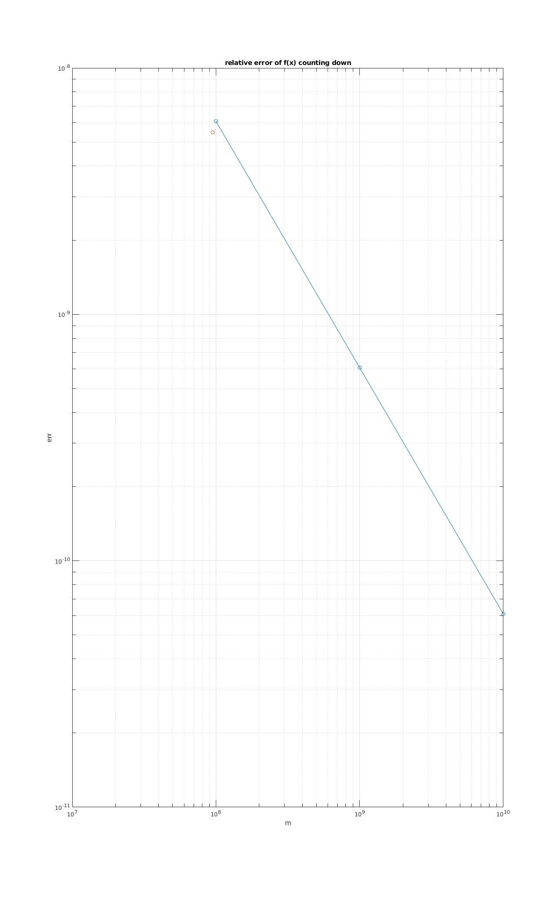

# CPSC 302 - Assignment 1

2018-09-27, Tristan Rice, 25886145, q7w9a

## Question 1

### (a)

Proof by induction.

$$f(n) = 3n^3-n^2, g(n) = n^3$$

$$c = 6, n_0 = 10$$

Base case.

$$|3(10)^3 - (10)^2| \leq 6(10)^3$$
$$|3000 - 100| \leq 6000$$
$$2900 \leq 6000$$

Induction step.

Assume $$f(n-1) \leq cg(n-1)$$.

We must show that $f(n)-f(n-1) \leq c (g(n)-g(n-1))$ since if $f$ grows slower than
$g$ it must be smaller.

$$|3n^3 - n^2 - 3(n-1)^3 + (n-1)^2| \leq  6(n^3 - (n-1)^3)$$

$$|(n-1)^2 - n^2| \leq  3(n^3 - (n-1)^3)$$
$$|n^2-2n+1 - n^2| \leq  3(n^3 - n^3 + 3n^2-3n+1)$$
$$|2n+1| \leq  9n^2-9n+9$$

This holds since $|2n+1|$ is trivially smaller than $9n^2-9n+9$.

Thus, $f(n) = O(g(n))$.

### (b)

Proof by induction.

$$f(n) = 3n^3+n^2, g(n) = n^3$$

Show $f(n) = \Theta(g(n))$.

$$c_1 = 1, c_2 = 6, n_0 = 10$$

Base case: $n = 10$

$$(10)^3 \leq 3(10)^3+(10)^2 \leq 6(10)^3$$
$$1000 \leq 3100 \leq 6000$$

Induction step.

Assume $$f(n-1) \leq cg(n-1)$$.

We must show that $c_1(g(n) - g(n-1)) \leq f(n)-f(n-1) \leq c_2 (g(n)-g(n-1))$ since if $f$ grows slower than
$g$ it must be smaller.

$$n^3 - (n-1)^3 \leq 3n^3+n^2 - 3(n-1)^3-(n-1)^2 \leq 6n^3 - 6(n-1)^3$$
$$n^3 - (n^3-3n^2+3n-1) \leq 3n^3+n^2 - 3(n^3-3n^2+3n-1)-(n^2-2n+1) \leq 6n^3 - 6(n^3-3n^2+3n-1)$$
$$3n^2-3n+1 \leq 3n^3+n^2 - 3n^3+9n^2-9n+9-n^2+2n-1 \leq 6n^3 - 6n^3+18n^2-18n+6$$
$$3n^2-3n+1 \leq 9n^2-7n+8 \leq 18n^2-18n+6$$
$$3n^2 \leq 9n^2-4n+7 \leq 18n^2-15n+5$$

We can ignore the smaller terms since they are $=o(n^2)$. Thus leaving us with:
$$3n^2 \leq 9n^2 \leq 18n^2$$

This clearly holds and thus $f(n) = \Theta(g(n))$.

## Question 2

### (a)

If you ever find a number less than 0, or greater than the number before you
know there's an error.

### (b)

True value $= 0.0024$.

```
u25ErrAbs = 2.3363e+12
u25ErrRel = 9.6964e+14
```

### (c)

$$\hat{u}_0 = u_0 + \epsilon _0$$

$$\hat{u}_n = -k \hat{u}_{n-1} + \frac{1}{n}$$

$$\hat{u}_1 = -k \hat{u}_{0} + \frac{1}{1} - u_1$$

$$\hat{u}_1 = -k (u_0 + \epsilon _0) + \frac{1}{1}$$
$$\hat{u}_1 - u_1 = -k (u_0 + \epsilon _0) + \frac{1}{1} - u_1$$
$$\hat{u}_1 - u_1 = -k (u_0 + \epsilon _0) + \frac{1}{1} +ku_0 - 1$$
$$\epsilon _1 = \hat{u}_1 -u_1= -k\epsilon _0$$

### (d)

$$\epsilon _2 = \hat{u}_2 - u_2 = -k(\hat{u}_1) + \frac{1}{2} + k(u_1) - \frac{1}{2}$$
$$\epsilon _2 = -k(\hat{u}_1) + k(u_1)$$
$$\epsilon _2 = -k(-k(u_0 + \epsilon _0) + 1) + k(-ku_0+1)$$
$$\epsilon _2 = k^2u_0 + k^2\epsilon _0 - k - k^2 u_0 + k$$
$$\epsilon _2 = k^2\epsilon _0$$

General rule:
$$\epsilon _n = (-k)^n \epsilon _0$$

Since the error is exponential, every iteration gets $-k$ times as much error. Thus at
$n=25$, the error is $(15)^n = 2.5 * 10^{29}$ times worse than at $n=0$.

### (e)

The observed error is very close to what we calculated. When comparing the
error for two sequential $u_n$ values we see that the error increases by almost
exactly $-k = -15$.

```
>> 2336290021325.815918/-155752668088.387726
ans = -15
```

### (f)

Emperically we see $\epsilon _0$ as

```
>> 2336290021325.815918/(-15)^25
ans = -9.2522e-18
```

Since floating points are represented using exponentials, we should be able to
divide the rounding error by $k$ to get the error adjusted by the exponent.
Which matches our empirical answer.

$$|\epsilon _0| \leq \frac{2^{-53}}{k}$$

$$|\epsilon _n| = k^n (\frac{2^{-53}}{k})$$


### (g)

$$\hat{u}_n = u_n + \epsilon _n$$

#### i.

$$\hat{u}_{n-1} = -\frac{\hat{u}_n}{k} + \frac{1}{kn}$$
$$\hat{u}_{n-1} = -\frac{u_n}{k} - \frac{\epsilon _n}{k} + \frac{1}{kn}$$
$$\hat{u}_{n-1} - u_{n-1} = -\frac{u_n}{k} - \frac{\epsilon _n}{k} + \frac{1}{kn} - u_{n-1}$$
$$\hat{u}_{n-1} - u_{n-1} = -\frac{u_n}{k} - \frac{\epsilon _n}{k} + \frac{1}{kn} + \frac{u_n}{k} - \frac{1}{kn}$$
$$\hat{u}_{n-1} - u_{n-1} = - \frac{\epsilon _n}{k}$$

#### ii.

$$\hat{u}_{n-2} = -\frac{\hat{u}_{n-1}}{k} + \frac{1}{k(n-1}$$
$$\hat{u}_{n-2} = -\frac{-\frac{u_n}{k} - \frac{\epsilon _n}{k} + \frac{1}{kn}}{k} + \frac{1}{k(n-1)}$$
$$\hat{u}_{n-2} - u_{n-2} = -\frac{-\frac{u_n}{k} - \frac{\epsilon _n}{k} + \frac{1}{kn}}{k} + \frac{1}{k(n-1)} -u_{n-2}$$
$$\hat{u}_{n-2} - u_{n-2} = \frac{u_n}{k^2} + \frac{\epsilon _n}{k^2} - \frac{1}{k^2n} + \frac{1}{k(n-1)} -u_{n-2}$$
$$\hat{u}_{n-2} - u_{n-2} = \frac{u_n}{k^2} + \frac{\epsilon _n}{k^2} - \frac{1}{k^2n} + \frac{1}{k(n-1)} -\frac{u_n}{k^2} + \frac{1}{k^2n} - \frac{1}{k(n-1)}$$
$$\hat{u}_{n-2} - u_{n-2} = \frac{\epsilon _n}{k^2} $$

#### iii.

$$\epsilon _{n} = \frac{\epsilon _N}{k^{N-n}}$$

#### iv.

Backwards recursion has a rounding error that is divided by $k$ for each step so
the total error is actually very small compared to the inverse.

### (h)

Forwards:

```
u25True = 0.0024
u25ErrAbs = 2.3363e+12
u25ErrRel = 9.6964e+14
```

Backwards:

```
u25True = 0.0024
u25ErrAbs = 9.6602e-05
u25ErrRel = 0.0401
```

The error is significantly less doing backwards recursion.

### (i)

## Question 3

### Part I.

$$fl(x + fl(y + z)) = 1.12345*10^0 + (3.12345*10^3-3.12345*10^3)$$
$$fl(x + fl(y + z)) = 1.12345*10^0 + (0.00000*10^3)$$
$$fl(x + fl(y + z)) = 1.12345*10^0$$

$$fl(x + fl(y + z)) = (1.12345*10^0 + 3.12345*10^3)-3.12345*10^3$$
$$fl(x + fl(y + z)) = (0.00112*10^3 + 3.12345*10^3)-3.12345*10^3$$
$$fl(x + fl(y + z)) =  3.12457*10^3-3.12345*10^3$$
$$fl(x + fl(y + z)) =  0.00112*10^3$$
$$fl(x + fl(y + z)) =  1.12000*10^0$$

$$1.12345*10^0 \not= 1.12000*10^0$$

Thus it holds $fl(x+fl(y+z)) \neq fl(fl(x+y)+z)$.

Relative error:

```
>> (1.12345-1.12)/1.12345
ans = 0.0031
```

### Part II.

```
>> 7.45678*10^3 - 7.45631*10^3
ans = 0.4700
```

$$fl(x) = 7.457*10^3$$
$$fl(y) = 7.457*10^3$$

$$\hat{z} = fl(fl(x) - fl(y))$$
$$\hat{z} = 0.000*10^0$$

Absolute error $7.457*10^3 - 0 = 7457$.

Relative error $(7457-0)/7457 = 1$.

## Question 4

$$f(x) = 1-cos(x)$$

$$\sin^2(x)+\cos^2(x) = 1$$
$$1-\cos(x) = 2\sin^2(x/2)$$

$$g(x) = 2\sin^2(x/2)$$

$$f(5*10^{-12}) = 0, g(5*10^{-12}) = 0.000000005000000$$

\


## Question 5

```
>> run p5.m
y = 1.644934057834575
i = 94906267
```

We compute 94906266 elements before stopping.

$$e_1 = 5.479642961076798*10^{-09}$$

\


