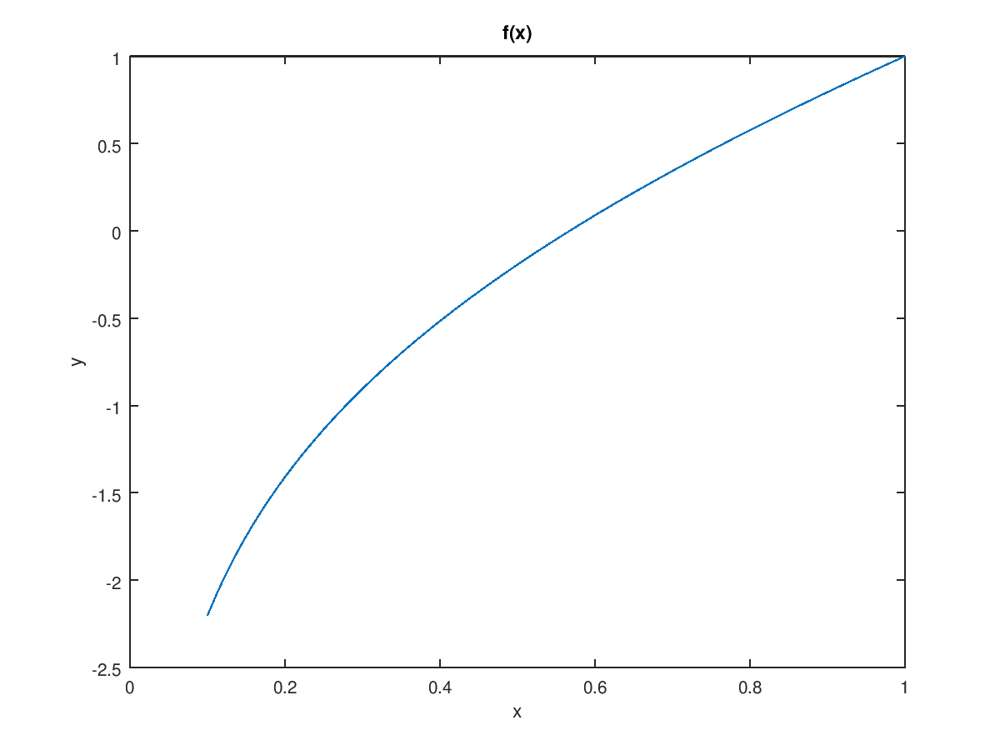
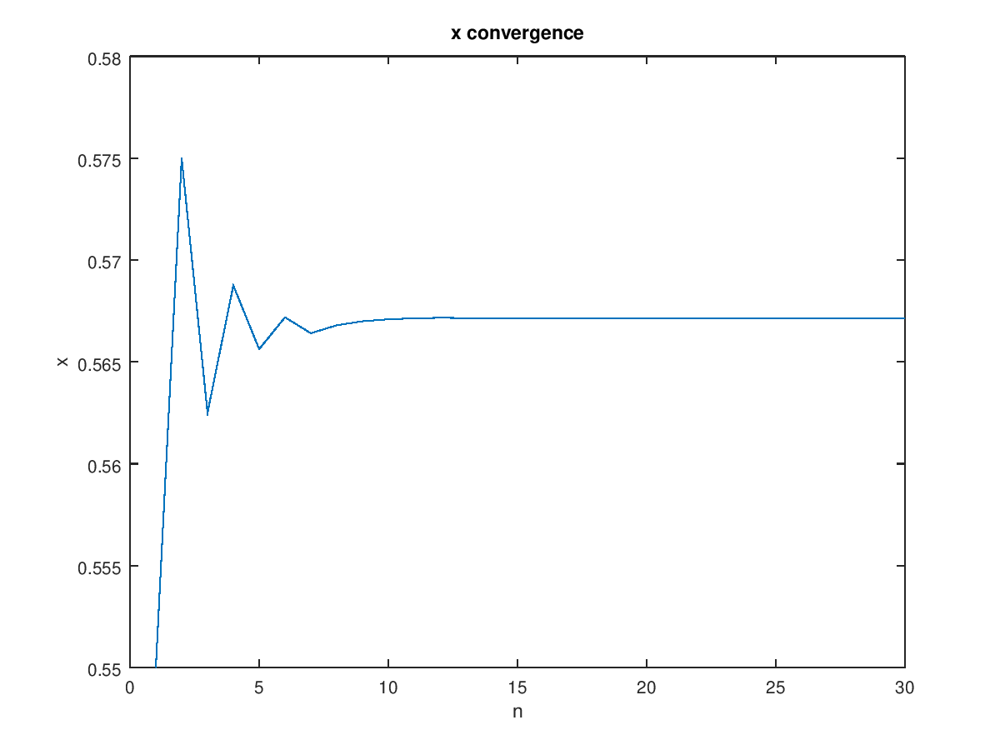
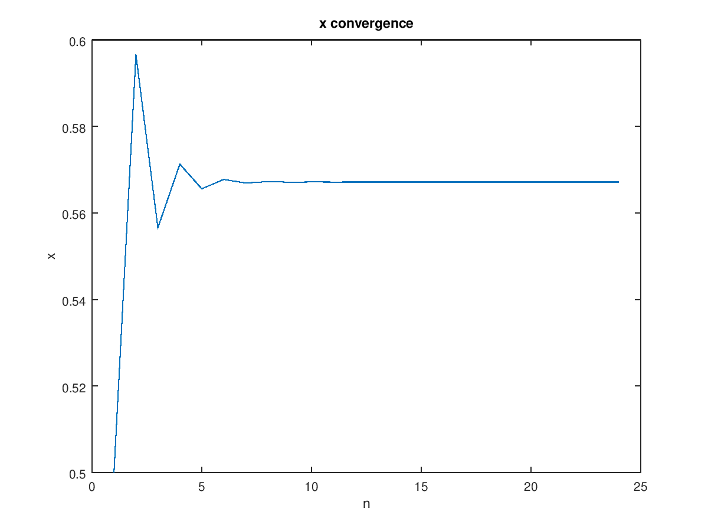
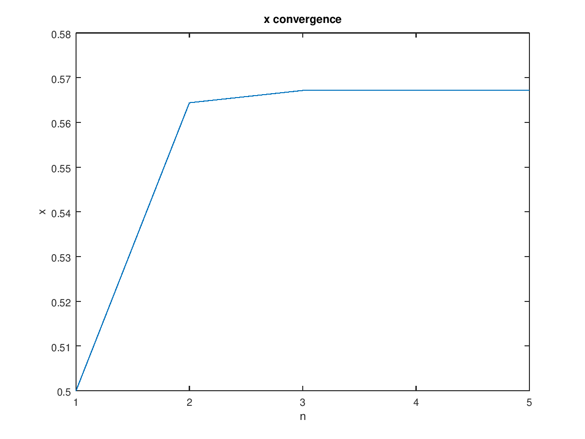
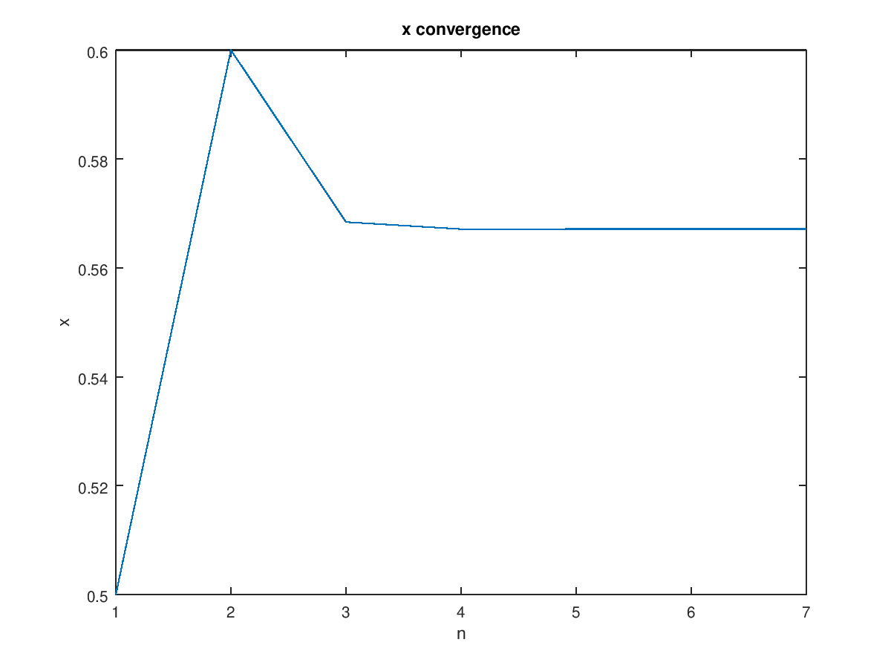
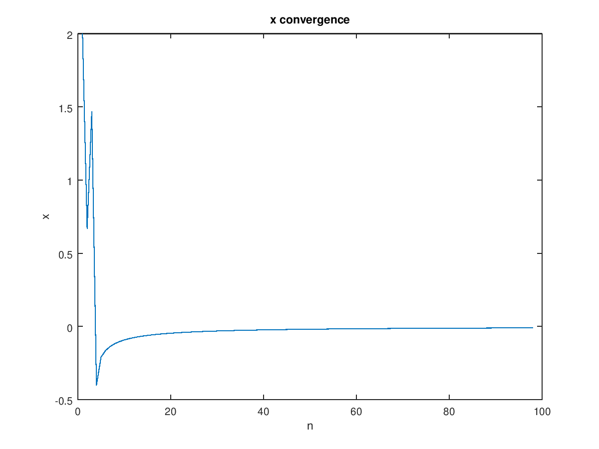
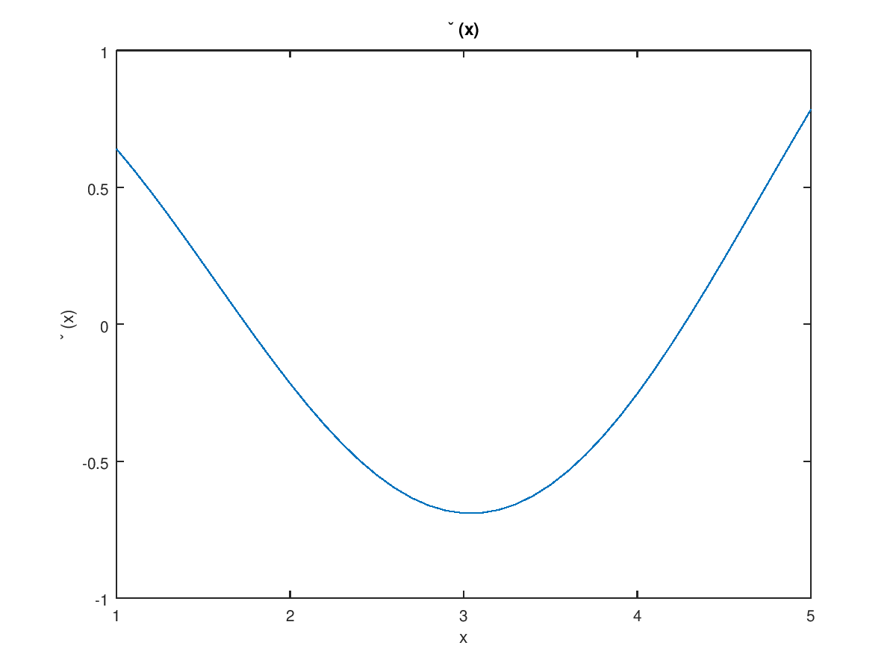

# CPSC 302 - Assignment 2

Tristan Rice, q7w9a, 25886145

## 1

### 1.a

\


### 1.b

#### 1.b.i

This is valid since the function is continuous on the interval, and one side is
less than 0 and one side greater. Thus, bisection works just fine.

\


Bisection took 30 iteration to find the value within the specified
tolerance. This very closely matches the theoretical value since the search
space is halved each iteration. $\log_2(\frac{0.6-0.5}{10^{-10}}) = 29.89735$.

#### 1.b.ii

$$g(x) = x - \frac{f(x)}{2}$$

Existence:

* $g(0.5) = 0.596574 \geq 0.5$
* $g(0.6) = 0.555413 \leq 0.6$

Uniqueness: The derivative $g'(x) = \frac{x-1}{2x}$ exists and there is a constant $\rho < 1$ between $0.5,0.6$.

Thus, the fixed point theorem holds and there is only one fixed point in the
range $[0.5, 0.6]$.

\


The maximum $\rho = \frac{1}{2}$ and minimum $\rho = \frac{1}{3}$ over the range
$[0.5,0.6]$.

If we use those to extrapolate the number of iterations it will take we get:

```
> log((0.6-0.5)/(1e-10), base=1/(1/3))
[1] 18.86313
> log((0.6-0.5)/(1e-10), base=1/(1/2))
[1] 29.89735
```

Since the number of iterations was actually 24, that fits the theoretical value
since that's the average of the endpoint estimates.

#### 1.b.iii

\


Newton's method takes 5 iterations. We expect Newton's method to converge
quadratically. Our empirical results match the theoretical since it takes
roughly the square root of how long our linearly convergent fixed point
function.

#### 1.b.iv

\


The secant method takes 7 iterations. We know that the order of convergence of
the secant method is roughly $1.618$, so it's not quite quadratic, but still
superlinear. Since 7 iterations is a lot fewer than the 24 the linearly
convergent method took and 7 iterations is slightly more than the 5 the
quadratically convergent function took, this fits our expectations quite well.

## 2

### 2.a

$$x^2+\frac{3}{16} = x$$
$$x^2-x+\frac{3}{16} = 0$$
$$x=\{\frac14, \frac34\}$$

### 2.b

$$f'(x) = 2x$$

You can be sure that $\frac14$ will converge using fixed point iteration since
the magnitude of the slope is less than $1$. $f'(\frac34)=\frac32$.

### 2.c

Need to find $\rho$.

$$\rho^n = \frac{1}{100}$$.
$$n = \frac{\log \frac{1}{100}}{\log \rho}$$
$$|x_k^2+\frac{3}{16} - (x^*)^2 - \frac{3}{16}| \leq \rho |x_k - x^*|$$
$$|x_k^2 - (x^*)^2| \leq \rho |x_k - x^*|$$
$$|x_k^2 - (x^*)^2| \leq \rho |x_k - x^*|$$
$$\frac{|x_k^2 - (x^*)^2|}{|x_k - x^*|} \leq \rho$$
$$\rho \geq x_k + x^*$$

$$n = \frac{\log \frac{1}{100}}{\log ( x_k + x^*)}$$

If we start at $x = \frac18, n=5$, if $x=1/2, n = 16$.

## 3

### 3.a

$$f(x) = (x-1)^2e^x$$
$$f'(x) = e^x(x^2-1)$$

$$x_{n+1} = x_n - \frac{f(x_n)}{f'(x_n)}$$
$$x_{n+1} = x_n - \frac{(x_n)^2e^x}{e^x(x_n^2-1)}$$
$$x_{n+1} = x_n - \frac{x_n^2}{x_n^2-1}$$

### 3.b

\


### 3.c

It'd be hard to implement the bisection method since the root doesn't cross the
x-axis. The intermediate value theorem doesn't help you since both sides of the
root are positive and thus bisection doesn't work.

However, you can apply a transformation to the function and use that. Since the
derivative at the root is zero, you should be able to take the
derivative of the function and then apply bisection.

## 4

### 4.a

\


I expect it to converge to the global minimum since there's only one local
minimum in the range [1,5] and it's also the global.

The computed minimum took 42 iterations, and found
$x=3.0414, \phi(x) = -0.69084$.

That matches the minimum in the plot quite well.

### 4.b

\


I don't expect it to necessarily converge to the global minimum since there's
multiple local minimums, and the algorithm can't know which way to go to find
the global minimum.

It takes 42 iterations once again. The computed minimum does not match the
analytical, global minimum. The global minimum is at $x*=-2$, where the found
minimum is at $x=2.4$. It found a local minimum but not the global minimum.


