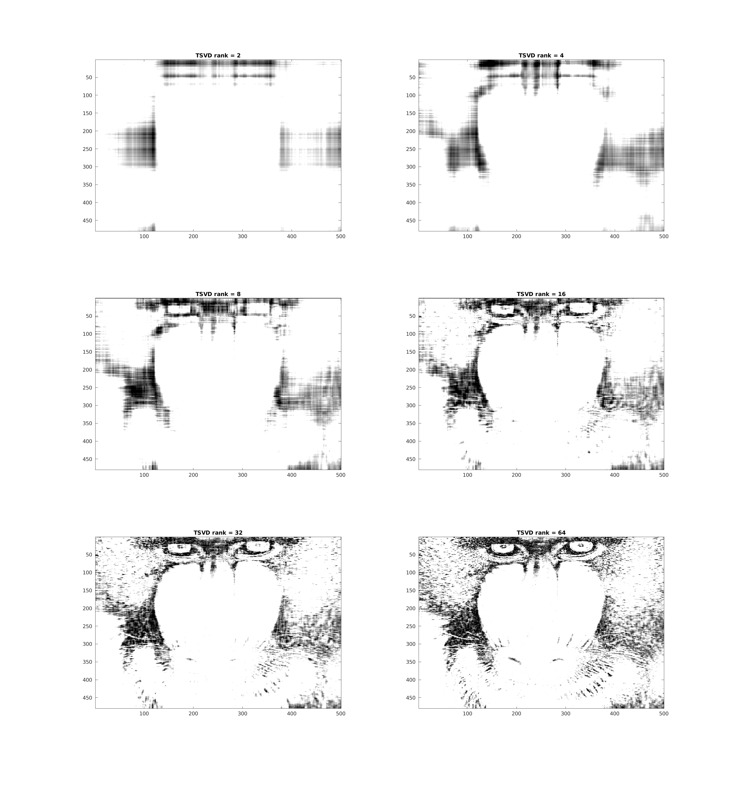
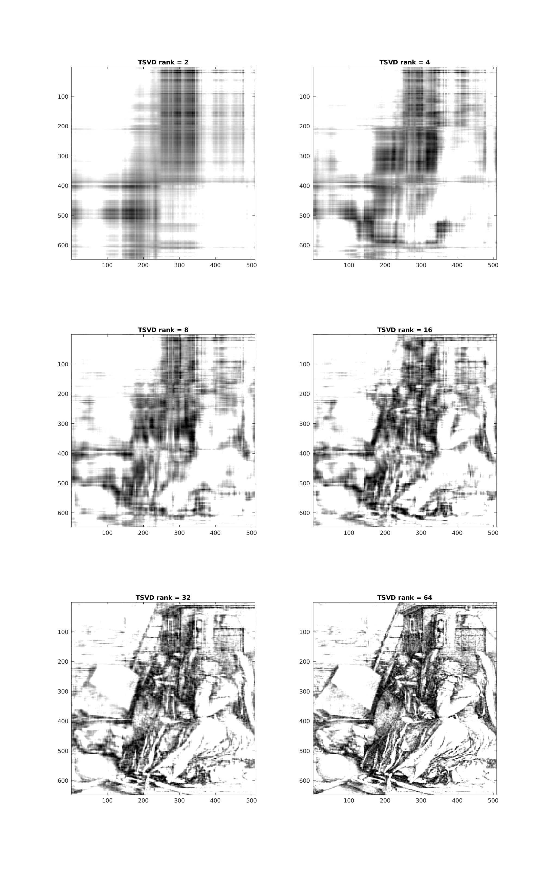

\


# CPSC 302 - Assignment 4

Tristan Rice, q7w9a, 25886145

## 1. Data Fitting

### 1.a

The equation $u(t)$ isn't linear, thus you can't find a perfect match using
linear least squares.

### 1.b

We're trying to solve for $v(t)=x_1 + x_2t$.

Normal equations: $$X^TXb=X^Ty$$

$$X=\begin{bmatrix}
1 & 0.0 \\
1 & 1.0 \\
1 & 2.0
\end{bmatrix}$$

$$y = \begin{bmatrix}
0.1 \\
0.9 \\
2
\end{bmatrix}$$


Solving the normal equations gives us
$$b=\begin{bmatrix}
0.05 \\
0.95
\end{bmatrix}$$

$$v(t) = 0.05 + 0.95t$$

$$u(t) = e^{v(t)} = e^{0.05 + 0.95t}$$
$$u(t) = e^{v(t)} = e^{0.05}e^{0.95t}$$
$$u(t) = 1.0512711e^{0.95t}$$


## 2. Classical Gram-Schmidt vs. Modified Gram-Schmidt

### 2.a

$$A=\begin{bmatrix}
1 & 1 & 1 \\
\epsilon & 0 & 0 \\
0 & \epsilon & 0 \\
0 & 0 & \epsilon
\end{bmatrix}$$

$$q_1 = \begin{bmatrix}
1 \\
\epsilon \\
0 \\
0
\end{bmatrix}$$

$$q_2 = \begin{bmatrix}
1 \\
0 \\
\epsilon \\
0
\end{bmatrix}
- \frac{\langle q_1, A_2 \rangle}{\langle q_1, q_1 \rangle}q_1$$

$$q_2 = \begin{bmatrix}
1 \\
0 \\
\epsilon \\
0
\end{bmatrix}
- \frac{1}{1+\epsilon^2}q_1$$

$1+\epsilon^2 = 1$ since $\epsilon$ is close to machine precision.

$$q_2 = \begin{bmatrix}
1 \\
0 \\
\epsilon \\
0
\end{bmatrix}
- q_1$$

$$q_2 = \begin{bmatrix}
0 \\
-\epsilon \\
\epsilon \\
0
\end{bmatrix}$$

$$q_3 = \begin{bmatrix}
1 \\
0 \\
0 \\
\epsilon
\end{bmatrix}
- \frac{\langle q_1, A_3 \rangle}{\langle q_1, q_1 \rangle}q_1
- \frac{\langle q_2, A_3 \rangle}{\langle q_2, q_2 \rangle}q_2$$

$$q_3 = \begin{bmatrix}
1 \\
0 \\
0 \\
\epsilon
\end{bmatrix}
- \frac{1}{1+\epsilon^2}q_1
- \frac{\epsilon^2}{2\epsilon^2}q_2$$

$$q_3 = \begin{bmatrix}
1 \\
0 \\
0 \\
\epsilon
\end{bmatrix}
- q_1
- \frac{1}{2}q_2$$

$$q_3 = \begin{bmatrix}
0 \\
-\epsilon \\
0 \\
\epsilon
\end{bmatrix}
- \frac{1}{2}q_2$$

$$q_3 = \begin{bmatrix}
0 \\
\frac{-\epsilon}{2} \\
\frac{-\epsilon}{2} \\
\epsilon
\end{bmatrix} $$

$$q_2^Tq_3 =
0 * 0
-\epsilon * \frac{-\epsilon}{2}
+ \epsilon * \frac{-\epsilon}{2}
+ 0 * \epsilon = 0$$


### 2.b

Modified Gram-Schmidt is the same as Classical Gram-Schmidt for the first two
columns.

$$A=\begin{bmatrix}
1 & 1 & 1 \\
\epsilon & 0 & 0 \\
0 & \epsilon & 0 \\
0 & 0 & \epsilon
\end{bmatrix}$$

$$q_1 = \begin{bmatrix}
1 \\
\epsilon \\
0 \\
0
\end{bmatrix}$$

$$q_2 = \begin{bmatrix}
1 \\
0 \\
\epsilon \\
0
\end{bmatrix}
- \frac{\langle q_1, A_2 \rangle}{\langle q_1, q_1 \rangle}q_1$$

$$q_2 = \begin{bmatrix}
1 \\
0 \\
\epsilon \\
0
\end{bmatrix}
- \frac{1}{1+\epsilon^2}q_1$$

$1+\epsilon^2 = 1$ since $\epsilon$ is close to machine precision.

$$q_2 = \begin{bmatrix}
1 \\
0 \\
\epsilon \\
0
\end{bmatrix}
- q_1$$

$$q_2 = \begin{bmatrix}
0 \\
-\epsilon \\
\epsilon \\
0
\end{bmatrix}$$

We now see the differences in how multiple projections are applied.

$$q_3^{(1)} = \begin{bmatrix}
1 \\
0 \\
0 \\
\epsilon
\end{bmatrix}
- \frac{\langle q_1, A_3 \rangle}{\langle q_1, q_1 \rangle}q_1$$

$$q_3^{(1)} = \begin{bmatrix}
1 \\
0 \\
0 \\
\epsilon
\end{bmatrix}
- \frac{1}{1+\epsilon^2}q_1$$

$$q_3^{(1)} = \begin{bmatrix}
1 \\
0 \\
0 \\
\epsilon
\end{bmatrix}
- q_1$$

$$q_3^{(1)} = \begin{bmatrix}
0 \\
-\epsilon \\
0 \\
\epsilon
\end{bmatrix}$$

$$q_3^{(2)} = \begin{bmatrix}
0 \\
-\epsilon \\
0 \\
\epsilon
\end{bmatrix}
- \frac{\langle q_2, q_3^{(1)} \rangle}{\langle q_2, q_2 \rangle}q_2$$

$$q_3^{(2)} = \begin{bmatrix}
0 \\
-\epsilon \\
0 \\
\epsilon
\end{bmatrix}
- \frac{\epsilon^2}{2\epsilon^2}q_2$$

$$q_3^{(2)} = \begin{bmatrix}
0 \\
-\epsilon \\
0 \\
\epsilon
\end{bmatrix}
- \frac{1}{2}q_2$$

$$q_3^{(2)} = \begin{bmatrix}
0 \\
-\frac{\epsilon}{2} \\
\frac{\epsilon}{2} \\
\epsilon
\end{bmatrix}$$

$$q_2^Tq_3 =
0 * 0
-\epsilon * \frac{-\epsilon}{2}
+ \epsilon * \frac{-\epsilon}{2}
+ 0 * \epsilon = 0$$

### 2.c

We got the same result for both methods. The modified Gram-Schmidt and Classical
Gram-Schmidt should return the same results, other than issues caused by fixed
floating point representations. Since we're doing this by hand, not all the
errors that would occur in a machine occur here. That explains why there are no
minute differences.

## 3. Comparison of Algorithms

### 3.a

$$A^TAx = A^Tb$$

$$A=\begin{bmatrix}
1 & 1 & 1 \\
\epsilon & 0 & 0 \\
0 & \epsilon & 0 \\
0 & 0 & \epsilon
\end{bmatrix}$$

$$b=\begin{bmatrix}
1 \\
0 \\
0 \\
0
\end{bmatrix}$$


$$A^Tb=\begin{bmatrix}
1 \\
1 \\
1
\end{bmatrix}$$

$$A^TA=\begin{bmatrix}
1 + \epsilon^2 & 1 & 1 \\
1 & 1 + \epsilon^2 & 1 \\
1 & 1 & 1 + \epsilon^2
\end{bmatrix}$$

For ease of writing, $a = x_1, b = x_2, c = x_3$:

$$(1+\epsilon^2)a + b + c = 1$$
$$a + (1+\epsilon^2)b + c = 1$$
$$a + b + (1+\epsilon^2)c = 1$$
$$a = 1 - b - (1+\epsilon^2)c$$

$$(1+\epsilon^2)(1 - b - (1+\epsilon^2)c) + b + c = 1$$
$$1 - b - (1+\epsilon^2)c + (1+\epsilon^2)b + c = 1$$
$$- b - (1+\epsilon^2)c + (1+\epsilon^2)b + c = 0$$
$$\epsilon^2 b + \epsilon^2c = 0$$
$$b=-c$$
$$(1+\epsilon^2)(1+c-(1-\epsilon^2)c)=1$$
$$1+c-(1-\epsilon^2)c=\frac{1}{1+\epsilon^2}$$
$$c\epsilon^2=\frac{1}{1+\epsilon^2} - 1$$
$$c=\frac{1}{\epsilon^2+\epsilon^4} - \frac{1}{\epsilon^2}$$
$$a=1 + c - (1-\epsilon^2)c$$
$$a=1 + \epsilon^2c$$
$$a=\frac{1}{1+\epsilon^2}$$

Thus,
$$x_1=\frac{1}{1+\epsilon^2}$$
$$x_2=-\frac{1}{\epsilon^2+\epsilon^4} + \frac{1}{\epsilon^2}$$
$$x_3=\frac{1}{\epsilon^2+\epsilon^4} - \frac{1}{\epsilon^2}$$


### 3.b

```
>> q3
Epsilon = 2.2204e-16:
  - Normal equations: err = 1.633, residual = 1.7206e-08
  - ClassicalGS: err = 1.5411, residual = 1.825e-08
  - ModifiedGS: err = 1.633, residual = 1.7206e-08
  - Householder: err = 1.633, residual = 1.7206e-08
  - Givens: err = 1.2247, residual = 2.1073e-08
  - QR: err = 1.633, residual = 1.7206e-08
  - Backslash: err = 1.633, residual = 1.7206e-08
  - SVD: err = 1.633, residual = 1.7206e-08
  - TSVD: err = 1.633, residual = 1.7206e-08
Epsilon = 2.2204e-16:
  - Normal equations: err = 1.4142, residual = 1.4901e-08
  - ClassicalGS: err = 1.4142, residual = 1.4901e-08
  - ModifiedGS: err = 1.4142, residual = 1.4901e-08
  - Householder: err = 1.633, residual = 8.6032e-09
  - Givens: err = 1.2247, residual = 1.0537e-08
  - QR: err = 1.633, residual = 8.6032e-09
  - Backslash: err = 1.633, residual = 8.6032e-09
  - SVD: err = 1.633, residual = 8.6032e-09
  - TSVD: err = 1.633, residual = 8.6032e-09
Epsilon = 2.2204e-16:
    <missing>
  - ClassicalGS: err = 0, residual = 4.4409e-16
  - ModifiedGS: err = 0, residual = 4.4409e-16
  - Householder: err = 0.8165, residual = 2.564e-16
  - Givens: err = 0, residual = 4.4409e-16
  - QR: err = 0, residual = 4.4409e-16
  - Backslash: err = 0, residual = 4.4409e-16
  - SVD: err = 0.8165, residual = 3.3918e-16
  - TSVD: err = 0.8165, residual = 3.3918e-16
Epsilon = 2.2204e-16:
    <missing>
  - ClassicalGS: err = 0, residual = 2.2204e-16
  - ModifiedGS: err = 0, residual = 2.2204e-16
  - Householder: err = 0.8165, residual = 1.282e-16
  - Givens: err = 0, residual = 2.2204e-16
  - QR: err = 0, residual = 2.2204e-16
  - Backslash: err = 0, residual = 2.2204e-16
  - SVD: err = 0.8165, residual = 2.564e-16
  - TSVD: err = 0.8165, residual = 2.564e-16
```
When very close to the machine precision solving via the normal equations
doesn't work since "Matrix is singular to working precision."

## 4. Regularization

### 4.a

$$A = U\Sigma V^T$$
$$A^TA + \gamma I = (U\Sigma V^T)^TU\Sigma V^T + \gamma I$$
$$A^TA + \gamma I = (U\Sigma V^T)^TU\Sigma V^T + \gamma I$$
Since $U$ is an orthoganal matrix, $U^TU = UU^T=I$.
$$A^TA + \gamma I = V\Sigma^T\Sigma V^T + \gamma I$$
Since $V$ is likewise an orthoganal matrix, we can represent
$\gamma I=V\gamma V^T$.
$$A^TA + \gamma I = V\Sigma^T\Sigma V^T + V\gamma V^T$$
$$A^TA + \gamma I = V(\Sigma^T\Sigma + \gamma I) V^T$$

Since this is a $m \times n$ matrix of rank $n$,
$$\kappa_2 = \frac{\sigma_1}{\sigma_n}$$

Thus, the condition number of $A$ is just the largest singular value of $A$
divided by the smallest singular value.

$$\kappa_2^2(A) = (\frac{\sigma_1}{\sigma_n})^2$$
$$\kappa_2(A^TA+\gamma I) = \frac{\sigma_1^2 + \gamma}{\sigma_n^2 + \gamma}$$

Thus,
$$ \kappa_2^2(A) \geq \kappa_2(A^TA+\gamma I)$$
$$\frac{\sigma_1^2}{\sigma_n^2}
\geq \frac{\sigma_1^2 + \gamma}{\sigma_n^2 + \gamma}$$

Thus $+ \gamma$ term makes the condition number closer to 1, and thus, we see
that
$$ \kappa_2^2(A) \geq \kappa_2(A^TA+\gamma I)$$

### 4.b

Normal equations
$$A^TAx=A^Tb$$

becomes

$$\min_{x} ||b-Ax||_2$$

We want to convert $(A^TA + \gamma I)x_{\gamma}=A^Tb$ into something similar.


$$(A^TA + \gamma I)x_{\gamma}=A^Tb$$
$$(A + \gamma (A^T)^{-1})x_{\gamma}=b$$
Now we have something in the form $Cx=d$ where our new
$C=A + \gamma (A^T)^{-1}$.

Thus, $$\min_{x_{\gamma}} ||b-(A + \gamma (A^T)^{-1})x_{\gamma}||_2$$

### 4.c

We can use the normal equations and the regularized normal equations to show
that $||x_{\gamma}||_2 \leq ||x||_2$.

$$A^TAx = A^Tb$$
$$(A^TA + \gamma I)x_{\gamma} = A^Tb$$
$$(A^TA + \gamma I)x_{\gamma} = A^TAx$$
$$(I + \gamma(A^TA)^{-1})x_{\gamma} = x$$

We know that $A^TA$ is positive definite, so it's inverse must also be positive
definite. Adding another positive definite matrix (the identity matrix in this
case) results in it being a positive definite matrix.

Thus, $||I + \gamma(A^TA)^{-1}||_2 \geq 1$ and $I + \gamma(A^TA)^{-1}$ is
positive definite.

Since positive definite is an extension of a scalar to matrixes, we know that
since the coefficient $A$ is positive definite that given $Ab = c$, $b \leq c$.
Thus, $x_{\gamma} \leq x$.

### 4.d

Running the regularized least squares it for the specified values gives us:

```
j = Inf:
  - gamma = 0
    <missing>
j = 0:
  - gamma = 1
  - err = 5.0286
j = 3:
  - gamma = 0.001
  - err = 5.025
j = 6:
  - gamma = 1e-06
  - err = 5.025
j = 12:
  - gamma = 1e-12
  - err = 5.025
TSVD:
  - err = 5.025
```

We can't directly compute $\gamma=0$ using Matlab since $A$ is very close to
singular. However, some small non-zero value of $\gamma$ for regularization
gives decent results. If it's too large it increases the error.

Using TSVD gives a very similar result to using regularization. Both TSVD and
regularization seem to give decent results for close to singular matrices that
you wouldn't be otherwise able to solve.

## 5. Compressing Image Information

### 5.a

\


\


### 5.b

Mandrill requires $480 * 500 = 240000$ locations. The compressed version
requires $r * (480 + 500 + 1)$ storage locations.

Durer requires $648*509 = 329832$ storage locations.
The compressed version requires $r * (648 + 509 + 1)$ storage locations.

It seems to be more effective for Mandrill.
If we look at how much data is lost for a given $r$ value we see that for
mandrill it's 26.1% ($64*(480+500+1)/(480*500) = 0.2616$) of the original
storage size. For durer it's 22.5% ($64*(648+509+1)/(648*509) = 0.2247$) of the
original size. This is due to the fact that mandrill is lower rank to start with
so it doesn't have to lose as much data to get to rank 64. Mandrill appears
better at a given $r$ value since it's closer to the original image and it has
fewer small details.

