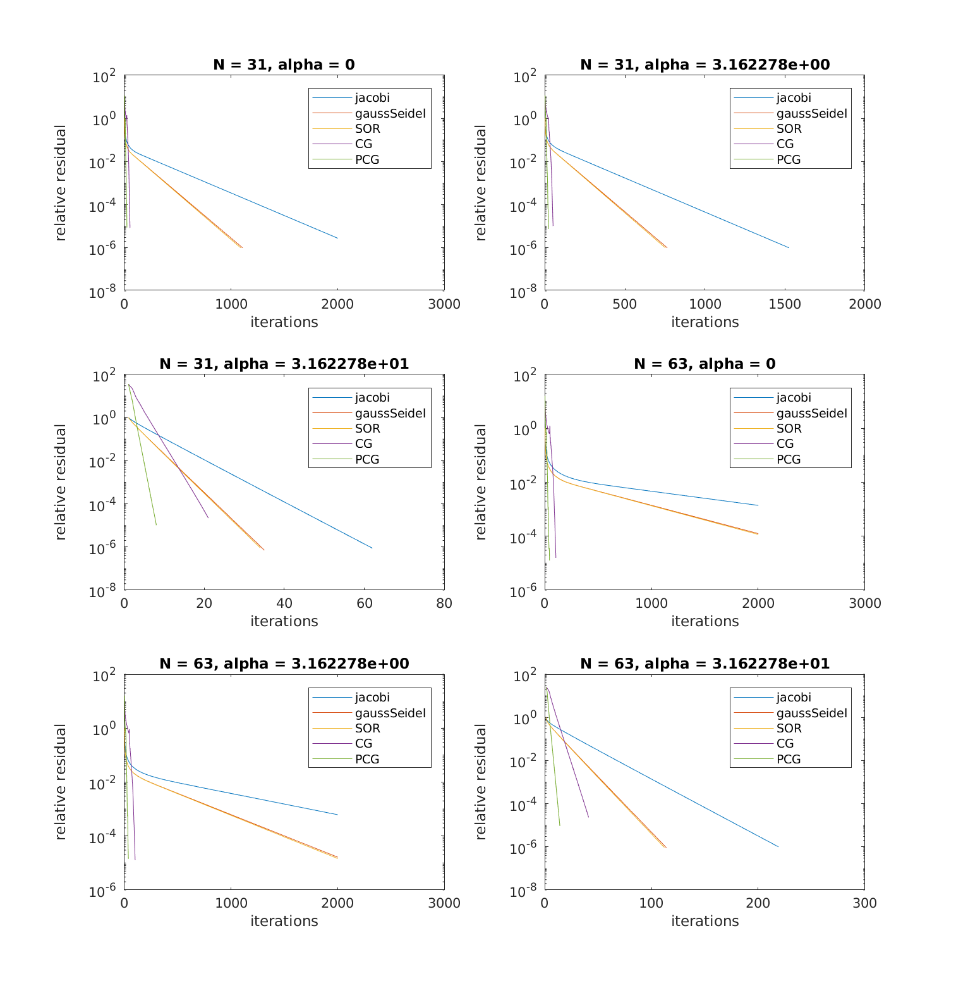

\


# CPSC 302 - Assignment 5

Tristan Rice, q7w9a, 25886145

Discussed with Bryan Chiu and Jerome Rasky

## 1. Stationary Method

### 1.a

$$A=M-N$$
$$Mx_{k+1} = Nx_k + b$$

$$x_{k+1} = x_k + \alpha (b-Ax_k)$$
$$x_{k+1} = x_k + \alpha b - \alpha Ax_k$$
$$x_{k+1} = (I-\alpha A)x_k + \alpha b$$
$$\frac{I}{\alpha} x_{k+1} = (\frac{I}{\alpha}-A)x_k + b$$

$$M = \frac{I}{\alpha}$$

$$T = (I-\alpha A)$$

### 1.b

#### 1.b.i

Converges only if $\rho(T) < 1$

Thus, only converges if $\rho(I-\alpha A) < 1$.

This converges if $\max_i|1-\alpha \lambda_i| < 1$.

#### 1.b.ii

To maximize the speed of convergence we need to minimize $\rho(T)$.

Thus, we need to find the values $\alpha$ that minimizes $\max_i|1-\alpha \lambda _i|$.

If $1 = \alpha \lambda _i$ for some $i$, that means it won't maximize
$|1-\alpha\lambda _i|$, since all eigenvalues are distinct and thus at least one
must be further away. Assuming one of the eigenvalues equals $1$ and $\alpha =
1$, the smallest possible convergence rate would be $|\lambda _1 - \lambda _n|$.

For the best possible rate, we want to minimize both
$|1-\alpha \lambda _1|, |1-\alpha \lambda _n|$ in order to have the fastest
possible rate.

$$1-\alpha \lambda_1 + 1 - \alpha \lambda _n = 0$$
$$\alpha \lambda_1 + \alpha \lambda _n = 2$$
$$\alpha (\lambda_1 + \lambda _n) = 2$$
$$\alpha = \frac{2}{\lambda_1 + \lambda _n}$$

Thus, we end up at the same best value for the step size in terms of maximizing
the speed of convergence.

The spectral radius works out to be

$$\rho(T) = \max_i|1-\frac{2 \lambda _i}{\lambda _1 + \lambda _n}|$$

The closest eigenvalue to $1$ will either be $\lambda _1$ or $\lambda _n$ due to
the scaling factor.

$$\rho(T) = \max\{
1-\frac{2 \lambda _n}{\lambda _1 + \lambda _n},
\frac{2 \lambda _1}{\lambda _1 + \lambda _n}-1
\} $$

$$\kappa _2(A) = \frac{\lambda _1}{\lambda _n}$$

$$\rho(T) = \max\{
1-\frac{2 }{\kappa _2(A) + 1},
\frac{2}{1 + \frac{1}{\kappa _2(A)}}-1
\} $$

### 1.c

Using the convergence condition above, for the statement to hold, there must be
no strictly diagonally dominant matrices with
$\alpha=1$ such that $\max_i|1-\alpha \lambda_i| < 1$.

A diagonal matrix is by definition strictly diagonally dominant and the
eigenvalues are just the values on the diagonal.

Thus we can construct a matrix with diagonal and eigenvalues
$\lambda = \{5,4,3\}$. Thus, the  $\max_i|1-\lambda_i| = |1-5| = 4$ and this statement
is contradicted since our convergence condition fails. Thus, this statement is
false.

## 2. Consider the two-dimensional partial differential equation ...

### 2.a

Since $B$ is symmetric we can express the condition number of it in terms of:

$$\kappa _2(B) = \frac{|\lambda |_{max}}{|\lambda|_{min}}$$

Since $A$ is also symmetric, we can find the eigenvalues of $B$ by adding
$(\alpha h)^2 I$ to each eigenvalue of $A$.

$$\lambda _{l,m} = 4 - 2 (\cos(l \pi h) + \cos(m \pi h)) + (\alpha h)^2,
1 \leq l,m \leq N$$

We need to find the maximum and minimum eigenvalues to determine the condition
number.

Since $\cos(0) = 1, \cos(\pi) = -1$ we see that having $l = m = 1$ minimizes the
second term and results in the smallest eigenvector.

The largest eigenvector is found when $l\pi h, m\pi h$ are close to $\pi$ since
that maximizes the second term.

$$\lambda_{min} = 4 - 2 (\cos (1 \pi h) + \cos(1 \pi h)) + (\alpha h)^2$$
$$\lambda_{max} = 4 - 2 (\cos (\lfloor N \rfloor \pi h) + \cos(\lfloor N \rfloor \pi h)) + (\alpha h)^2$$

$$\kappa _2 (B) = \frac{
4 - 2 (\cos (1 \pi h) + \cos(1 \pi h)) + (\alpha h)^2
}{
4 - 2 (\cos (\lfloor N \rfloor \pi h) + \cos(\lfloor N \rfloor \pi h)) + (\alpha h)^2
}$$

$$\kappa _2 (B) = \frac{
4 - 2 (\cos (\lfloor N \rfloor \pi  \frac{1}{N+1}) + \cos(\lfloor N \rfloor \pi  \frac{1}{N+1})) + (\alpha  \frac{1}{N+1})^2
}{
4 - 2 (\cos (1 \pi \frac{1}{N+1}) + \cos(1 \pi  \frac{1}{N+1})) + (\alpha  \frac{1}{N+1})^2
}$$

```m
> n = 1:20; N = sqrt(n)
N =

   1.0000   1.4142   1.7321   2.0000   2.2361   2.4495   2.6458   2.8284
   3.0000   3.1623   3.3166   3.4641   3.6056   3.7417   3.8730   4.0000
   4.1231   4.2426   4.3589   4.4721

> k2 = (4 -2 * (cos(floor(N) * pi /(N+1)) + cos(floor(N) * pi / (N+1))) +
> (alpha./(N+1)).^2)./(4-2*(cos(pi./(N+1)) + cos(pi./(N+1))) +
> (alpha./(N+1)).^2)

   1.2381   1.5050   1.7508   1.9843   2.2095   2.4285   2.6428   2.8532
   3.0605   3.2650   3.4673   3.6676   3.8660   4.0629   4.2584   4.4526
   4.6456   4.8376   5.0286   5.2186
```

We see that increasing $n$ causes the condition number to increase since the
$\cos$ terms get closer to $1, -1$.


### 2.b

```
N = 31, n = 961, k2(B) = 4.143451e+02
jacobi: 2000 iters
gaussSeidel: 1108 iters
SOR: 1090 iters
cg: 52 iters
pcg: 23 iters

N = 31, n = 961, k2(B) = 2.752810e+02
jacobi: 1525 iters
gaussSeidel: 764 iters
SOR: 752 iters
cg: 50 iters
pcg: 22 iters

N = 31, n = 961, k2(B) = 8.994868e+00
jacobi: 61 iters
gaussSeidel: 34 iters
SOR: 33 iters
cg: 20 iters
pcg: 7 iters

N = 63, n = 3969, k2(B) = 1.659380e+03
jacobi: 2000 iters
gaussSeidel: 2000 iters
SOR: 2000 iters
cg: 102 iters
pcg: 42 iters

N = 63, n = 3969, k2(B) = 1.101665e+03
jacobi: 2000 iters
gaussSeidel: 2000 iters
SOR: 2000 iters
cg: 100 iters
pcg: 37 iters

N = 63, n = 3969, k2(B) = 3.309512e+01
jacobi: 218 iters
gaussSeidel: 113 iters
SOR: 111 iters
cg: 40 iters
pcg: 13 iters
```

We see that the speed of convergence is: Jacobi > Gauss-Seidel > SOR > CG > PCG.

The difference in speed of convergence makes sense since that's what the
theoretical convergence rates of the different methods tells us. We also see
that with varying $N, \alpha$ params that the speed of convergence is correlated
with the condition number. Problems that are better conditioned converge faster.


\


## 3. Suppose we wish to solve Ax = b ...

### 3.a

Increasing `diagonalIncrement` causes gsMorph to converge faster.

Increasing the diagonal entries of A increases the spectral radius of A. This
increase causes the spectral radius of the convergence matrix to go down since
the iteration matrix is $I - M^{-1}A$.

### 3.b

N/A

## 4. The smoothing factor ...

### 4.a

$A$ is the discrete Laplacian.

$$x_{k+1} = x_k + \omega D^{-1}(b-Ax_k)$$
$$x_{k+1} = (I-\omega D^{-1}A)x_k + \omega D^{-1}b$$

$$T_\omega = I -\omega D^{-1}A$$

$$T_\omega v_{l,m} = (I -\omega D^{-1}A) v_{l,m}$$
$$T_\omega v_{l,m} = v_{l,m} -\omega D^{-1}A v_{l,m}$$

The definition of an eigenvector and eigenvalue pair is

$$Av = \lambda v$$

The diagonal values for $A$ are all the same by definition, thus you can write
$D = dI, D^{-1} = I/d$.

$$T_\omega v_{l,m} = v_{l,m} -\omega d^{-1}\lambda _{l,m} v_{l,m}$$

$$T_\omega v_{l,m} = (1 -\omega d^{-1}\lambda _{l,m} )v_{l,m}$$

Thus for $T_\omega$ the eigen vectors are the same, and the eigenvalues are
$1-\omega d^{-1} \lambda _{l,m}$ where $\lambda _{l,m}$ are the eigenvalues of $A$.


### 4.b

The eigenvalues for $A$ are
$$\lambda _{l,m} = 4 - 2 (\cos(l \pi h) + \cos(m \pi h)),
1 \leq l,m \leq N$$

Thus, the eigenvalues of the iteration matrix are:

$$\mu _{l,m} = 1-\omega d^{-1} (4 - 2 (\cos(l \pi h) + \cos(m \pi h)))$$

$d=4$ for the 2D Laplacian

$$\mu _{l,m} = 1-\omega (1 - \frac{1}{2} (\cos(l \pi h) + \cos(m \pi h)))$$

$|\mu_{l,m}|$ is maximized when $l = \frac{N+1}{2}, m = 1$ or when $l = m = N$.

Thus those factors are:

$$\mu _{(N+1)/2,1} = 1-\omega (1 - \frac{1}{2} (\cos(\frac{(N+1)\pi}{2(N+1)}) + \cos(\frac{\pi}{N+1})))$$

$$\mu _{(N+1)/2,1} = 1-\omega (1 - \frac{1}{2} (\cos(\frac{\pi}{2}) + \cos(\frac{\pi}{N+1})))$$
$$\mu _{(N+1)/2,1} = 1-\omega (1 - \frac{1}{2} \cos(\frac{\pi}{N+1}))$$

$$\lim_{N\to\infty} \mu _{(N+1)/2,1} = 1-\omega (1 - \frac{1}{2} \cos(0))$$
$$\lim_{N\to\infty} \mu _{(N+1)/2,1} = 1-\omega (1 - \frac{1}{2})$$
$$\lim_{N\to\infty} \mu _{(N+1)/2,1} = 1- \frac{\omega}{2}$$

$$\lim_{N\to\infty} \mu _{N,N} = 1-\omega (1 - \frac{1}{2} (\cos(\pi) + \cos(\pi)))$$
$$\lim_{N\to\infty} \mu _{N,N} = 1-\omega (1 + 1) = 1-2\omega$$

Since these both are maxes we need to solve for a $\omega^*$ that maximizes them
both.

$$1-2\omega^* + 1-\frac{\omega^*}{2} = 0$$
$$2\omega^* + \frac{\omega^*}{2} = 2$$
$$5\omega^* = 4$$
$$\omega^* = \frac{4}{5}$$

We can plug this value back into the earlier eigenvalue expressions to get
$$\mu ^* = |1-2(\frac{4}{5})| = \frac{3}{5}$$


### 4.c

$$\mu _{l,m} = 1-\omega d^{-1} (4 - 2 (\cos(l \pi h) + \cos(m \pi h)))$$

In this case, $\omega = 1, d = 4$.

$$\mu _{l,m} = 1-(1 - \frac{1}{2} (\cos(l \pi h) + \cos(m \pi h)))$$
$$\mu _{l,m} =  \frac{1}{2} (\cos(l \pi h) + \cos(m \pi h))$$

$$h = \frac{1}{N + 1}$$

We're interested in the maximum eigenvalue of the iteration matrix. In this
case, that's when $|\cos(\frac{l,m \pi}{N+1})|$ is largest. That means the insides
is closest to $0$.

We are constrained by $\frac{N+1}{2} \leq l \leq N, 1 \leq m \leq N$. Thus,
$|\cos(\ldots)|$ is maximized when $l =m = N$.

$$\mu _{l,m} =  \frac{1}{2} (\cos(\frac{N\pi}{(N+1)}) + \cos(\frac{N\pi}{N+1}))$$

If we take the limit
$$\lim_{N\to\infty} \mu _{l,m} = \frac{1}{2} (\cos(\pi) + \cos(\pi))$$
$$\lim_{N\to\infty} \mu _{l,m} = -1$$

The scaling factor $\mu*(\omega = 1) = |-1| = 1$. Since the scaling factor is
$1$, that means no scaling occurs and that Jacobi is not an effective smoother.
