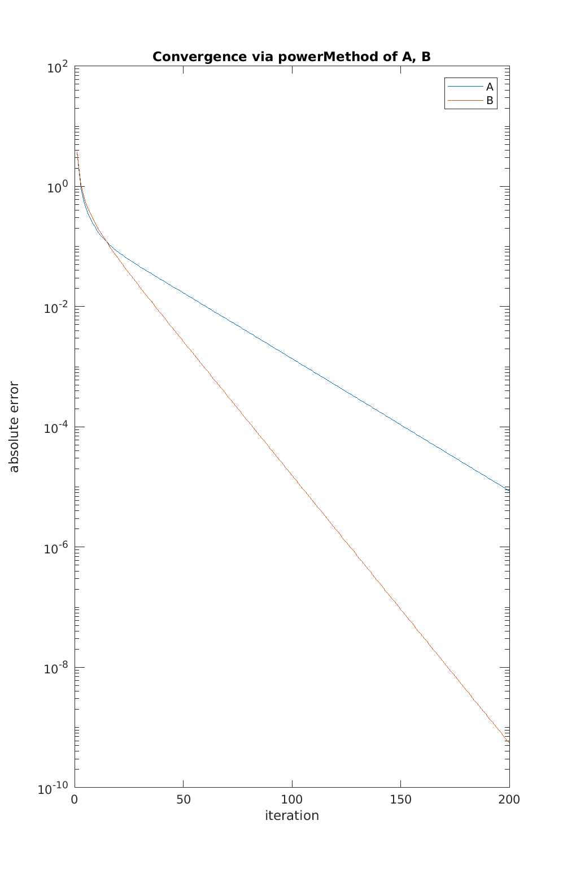
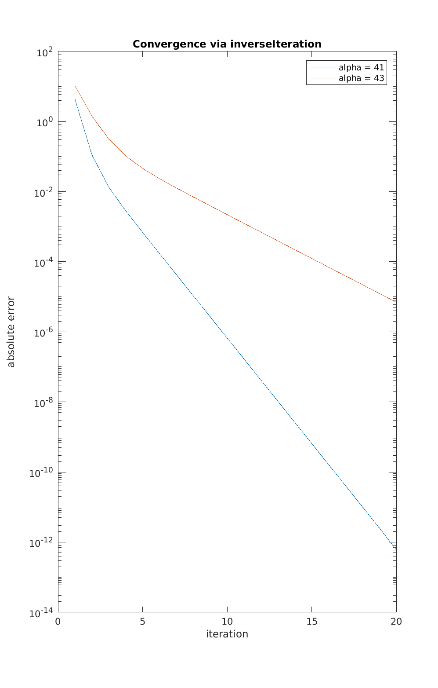

\


# CPSC 302 - Assignment 6

Tristan Rice, q7w9a, 25886145

Discussed with William Qi.

## 1.

Omitted

## 2.

### 2.a

$$r_0 = 1, r_1 = 2, r_n = 1$$

Thus, we know the eigen values are located in the union:
$$|z-2| \leq 1 \cup |z-2| \leq 2$$

### 2.b

Yes, you can narrow this down. Since the matrix is symmetric, we know all the
eigenvalues will be real.

### 2.c

As the iteration number goes up, the convergence rate approaches $1$ i.e. it
gets slower and slower as time goes on. The amount of relative difference
between one iteration and the next goes to $1$.

At $k = 1000$, we get an error of $8.8816*10^{-16}$.

```
e =

    3.9190


v =

    0.1201
   -0.2305
    0.3223
   -0.3879
    0.4221
   -0.4221
    0.3879
   -0.3223
    0.2305
   -0.1201
```

### 2.d

The fastest subdiagonal to reduce was the last ($n-1$) one. The first
subdiagonal was initially fast, but then the others caught up to it and was
reduced last.

Eigenvalues computed

```
3.9190
3.6825
3.3097
2.8308
2.2846
1.7154
1.1692
0.6903
0.3175
0.0810
```

### 2.e

Eigenvalue $3.9190$, eigenvector:

```
ans =

    0.1201
   -0.2305
    0.3223
   -0.3879
    0.4221
   -0.4221
    0.3879
   -0.3223
    0.2305
   -0.1201
```

## 3.

### 3.a

\


```
Aconvergence =

   -0.0253


Bconvergence =

   -0.0513
```

If we look at the $\log(\frac{\lambda_2}{\lambda_1})$ values we see that B is
twice that of A (2.0260). Those convergence rates match the graphed differences.


### 3.b

\


We see much faster iteration using inverse iteration than with the power method.
We see that an eigenvalue of 41 converges much faster than an eigenvalue of 43
since it's closer to the dominant eigenvalue--40.


For Rayleigh quotient it doesn't converge since inverse iteration is only
converging if the shift is greater than the largest eigenvalue.


## 4.

Omitted
